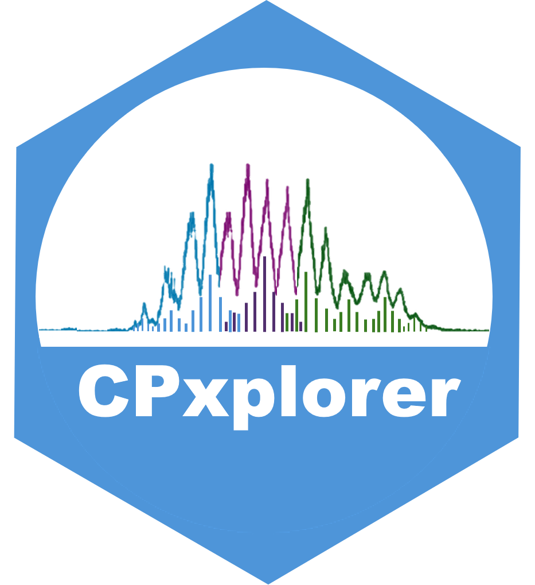

<!-- Knit this README.Rmd to generate README.md -->

# CPxplorer
  
<!-- badges: start -->
  
   

  
  
```{r, include = FALSE}
knitr::opts_chunk$set(
  collapse = TRUE,
  comment = "#>",
  out.width = "100%"
)
```
  
  
<!-- badges: end -->


### Installation
  
<!-- You can install the released version of CPxplorer from [CRAN](https://CRAN.R-project.org) with: -->

<!-- ``` r -->
<!-- install.packages("CPxplorer") -->
<!-- ``` -->
  

To install this R package directly from Github:  
``` r
install.packages("devtools")
devtools::install_github("WBS-TW/CPxplorer")

```
  
After installation, attach the package by:  
``` r
library(CPxplorer)
```
  
These functions will then be available:  
`CPions()`: opens a shiny app to generate ions of PCAs and analogues   
`CPquant()`: opens a shiny app to analyze and quantify output from Skyline  
  
  
  


