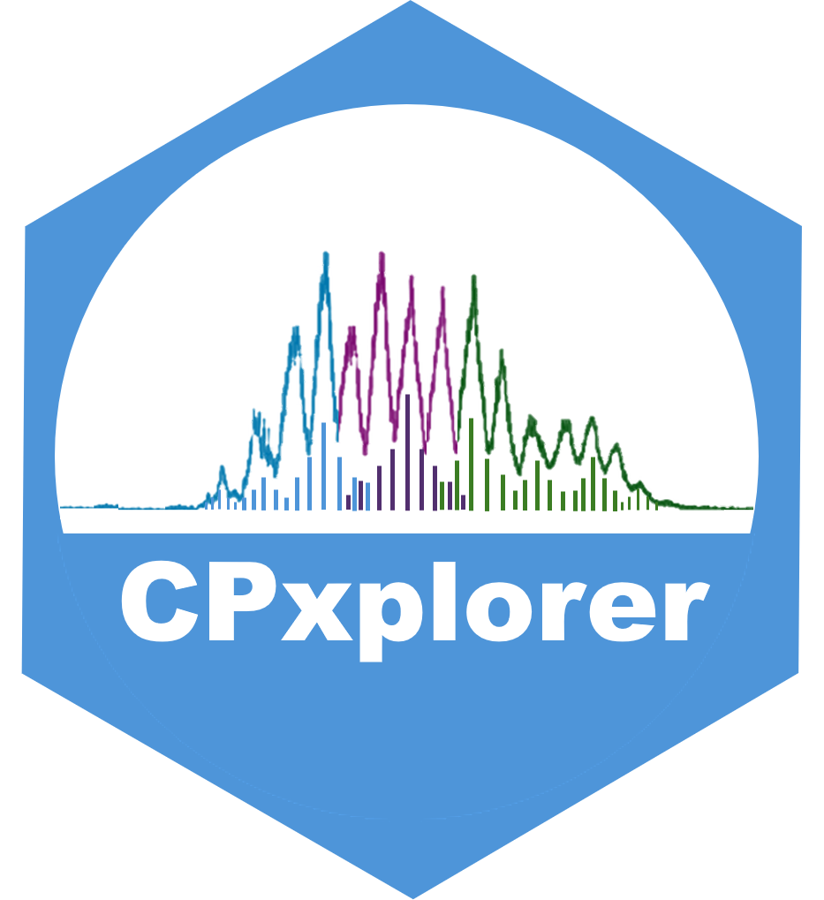

README
================

<!-- Knit this README.Rmd to generate README.md -->

# CPxplorer

<!-- badges: start -->



<!-- badges: end -->

### Installation

<!-- You can install the released version of CPxplorer from [CRAN](https://CRAN.R-project.org) with: -->
<!-- ``` r -->
<!-- install.packages("CPxplorer") -->
<!-- ``` -->

The development version is available at
[GitHub](github.com/WBS-TW/CPxplorer):

To install this R package directly from Github:

``` r
install.packages("devtools")
devtools::install_github("WBS-TW/CPxplorer")
```

After installation, these functions will be available:  
`CPions()`: opens a shiny app to generate ions of PCAs and analogues  
`CPquant()`: opens a shiny app to analyze and quantify output from
Skyline
